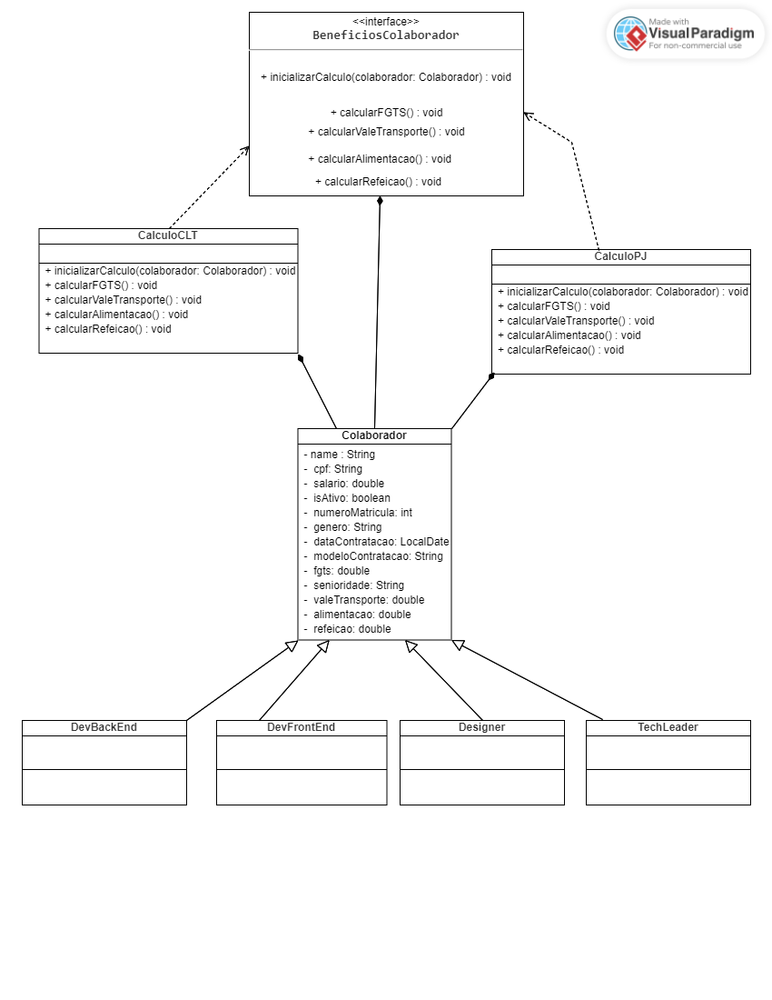

## Especificação 📝
 Este projeto tem como objetivo construir um programa que gerencie informações essenciais sobre colaboradores e seus benefícios. Utilizando conceitos fundamentais de programação orientada a objetos, como classe abstrata, herança, encapsulamento e especialização, buscamos criar uma estrutura de código flexível e modular.

## 📝 Diagrama de Classes e Relacionamentos



## 🛠  Tecnologias
- [Java](https://docs.oracle.com/en/java/javase/17/docs/api/index.html)

##  Como executar 🚀 
Clone o projeto e acesse a pasta

```bash
$ git clone https://github.com/alitakallyne/AtvClasseAbstrata.git && cd AtvClasseAbstrata
```
## 💻 Project

Este projeto foi desenvolvido no  **[Curso Backend do VNW](https://vainaweb.com.br/)**


---

<p align="center">Made with ✨  by Alita Kallyne</p>
